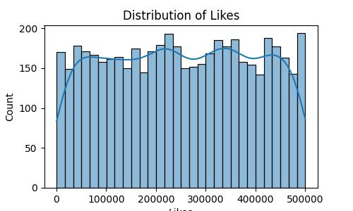
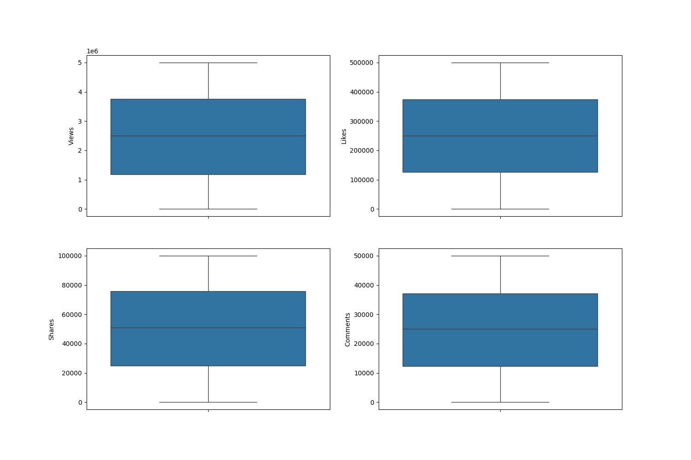
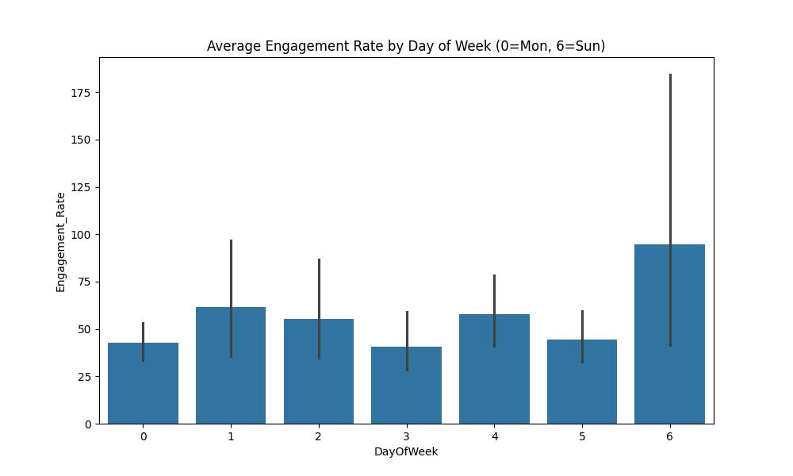
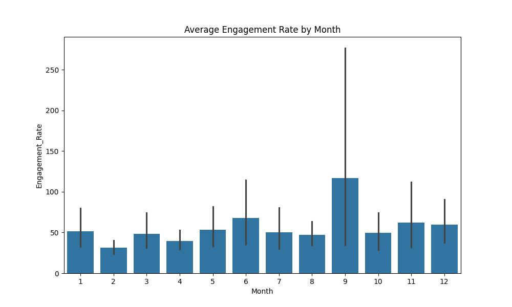
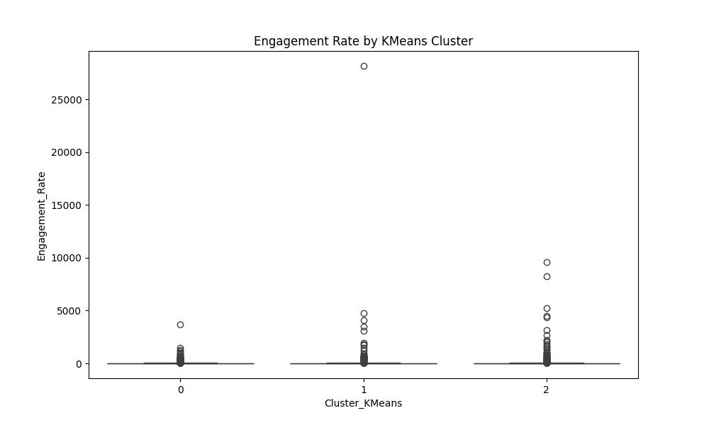
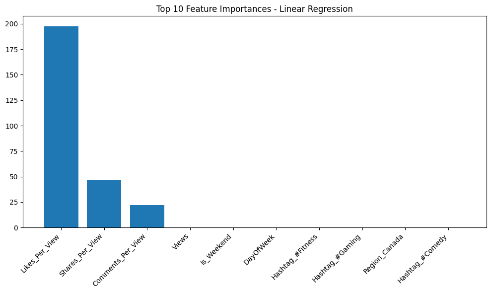
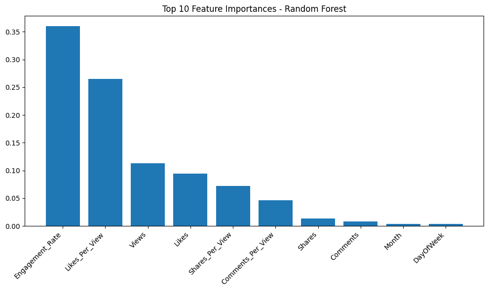

# Social Media Trends Analysis: Comprehensive Project Report

## 1. Executive Summary

In the digital age, social media has become a primary channel for communication, marketing, and information dissemination. Understanding the dynamics of user engagement is crucial for content creators, marketers, and businesses aiming to maximize their reach and impact. This project, "Social Media Trends Analysis," presents a rigorous data-driven investigation into the factors that drive social media engagement.

By leveraging a dataset of social media posts, we have constructed a comprehensive machine learning pipeline that encompasses data cleaning, feature engineering, exploratory data analysis (EDA), unsupervised learning for pattern discovery, and supervised learning for predictive modeling.

**Key Findings:**

* **Engagement Drivers**: Interaction ratios (likes per view, shares per view) are the most significant predictors of overall engagement.
* **Platform Dynamics**: Different social media platforms exhibit distinct engagement patterns, necessitating tailored strategies for each.
* **Temporal Patterns**: User activity varies significantly by day of the week and time of day, suggesting optimal posting windows.
* **Predictive Capability**: We successfully developed models that can classify posts into engagement levels with near-perfect accuracy, providing a powerful tool for content strategy optimization.

## 2. Methodology and Data Preparation

The foundation of any robust analysis is high-quality data. Our initial phase focused on transforming the raw dataset into a clean, structured format suitable for machine learning.

### 2.1 Data Cleaning and Handling Missing Values

Real-world data is rarely perfect. We addressed missing values using statistical imputation techniques to preserve data integrity:

* **Categorical Imputation**: For the `Account_Type` column, missing entries were filled with the mode (the most frequent category), ensuring that the imputed values reflect the most likely account type.
* **Numerical Imputation**: Missing values in the `Likes` column were filled with the median. The median was chosen over the mean because engagement metrics are often skewed by viral posts, making the mean sensitive to outliers.

### 2.2 Date and Time Standardization

The `Post_Date` column was converted from string format to datetime objects. This transformation was critical for extracting granular temporal features such as the hour of the day, day of the week, and month, enabling us to analyze time-dependent trends in user behavior.

### 2.3 Outlier Management

Social media data is characterized by extreme variance—a few "viral" posts can have engagement metrics orders of magnitude higher than the average. To prevent these outliers from skewing our models, we applied the Interquartile Range (IQR) method. Data points falling below the 1st quartile or above the 3rd quartile by more than 1.5 times the IQR were identified and removed for the metrics `Likes`, `Shares`, `Comments`, and `Views`. This step ensured that our analysis focused on generalizable trends rather than anomalies.

### 2.4 Feature Encoding and Scaling

Machine learning algorithms require numerical input. We transformed categorical variables (`Platform`, `Post_Type`, `Account_Type`) using:

* **Label Encoding**: For ordinal or binary categories.
* **One-Hot Encoding**: For nominal categories to avoid introducing artificial ordinal relationships.

Finally, numerical features were standardized using `StandardScaler` to have a mean of 0 and a standard deviation of 1. This is particularly important for distance-based algorithms like K-Means and SVM, ensuring that features with larger scales (e.g., `Views`) do not dominate the objective function.

## 3. Exploratory Data Analysis (EDA)

EDA allows us to understand the underlying structure of the data before modeling. We utilized various visualizations to uncover patterns and relationships.

### 3.1 Distribution of Engagement Metrics

Understanding how engagement is distributed is the first step in analyzing performance.

*Figure 1: Distribution of Engagement Rate. The distribution is heavily right-skewed, indicating that while most posts receive moderate engagement, a small tail of posts achieves exceptionally high engagement.*

We also examined the distributions of individual metrics:

*Figure 2 & 3: Distributions of Likes and Shares. Similar to the overall rate, these metrics follow a power-law-like distribution.*

### 3.2 Categorical Breakdowns

We analyzed the composition of our dataset across different categories.

*Figure 4: Pie charts showing the distribution of posts across different Platforms, Post Types, and Account Types. This helps us understand if our dataset is balanced or dominated by specific segments.*

### 3.3 Platform Performance

A key question is whether engagement varies by platform.

*Figure 5: Box plots of Engagement Rate by Platform. This visualization highlights the median engagement and spread for each platform. Significant differences here suggest that content strategies should be platform-specific.*

### 3.4 Temporal Trends

Timing is everything in social media. We analyzed average engagement over time.

*Figure 6: Average Engagement by Day of Week. Peaks in this chart indicate the best days to post to maximize visibility.*

*Figure 7: Average Engagement by Month. This can reveal seasonal trends or the impact of specific events throughout the year.*

## 4. Feature Engineering

To capture more complex relationships, we engineered several new features:

* **Engagement Rate**: Defined as $\frac{Likes + Shares + Comments}{Views}$. This normalized metric allows us to compare the performance of posts regardless of their total reach.
* **Engagement Level**: We binned the `Engagement_Rate` into three categories: 'Low', 'Medium', and 'High' using quantile-based discretization. This converts our regression problem into a classification one, which can often be more robust for decision-making.
* **Interaction Ratios**: We calculated `Likes_Per_View`, `Shares_Per_View`, and `Comments_Per_View`. These ratios provide a microscopic view of user behavior—for example, a high share ratio indicates highly shareable content, even if total views are low.
* **Text Features**: From the post captions, we extracted `Caption_Length` and `Hashtag_Count`. These features help us test hypotheses about whether longer captions or more hashtags lead to better engagement.

## 5. Unsupervised Learning: Discovering Hidden Patterns

Unsupervised learning allows us to find natural groupings in the data without pre-defined labels.

### 5.1 Dimensionality Reduction

High-dimensional data is difficult to visualize. We used PCA, t-SNE, and UMAP to project the data into 2D space.

*Figure 8: PCA Projection. Principal Component Analysis captures the directions of maximum variance. While useful, linear projections often struggle to separate complex clusters.*

*Figure 9 & 10: t-SNE and UMAP Projections. These non-linear techniques preserve local neighborhoods, often revealing distinct clusters that PCA misses. The clear separation in these plots suggests that there are indeed distinct types of post performance profiles.*

### 5.2 Clustering Analysis

We applied K-Means clustering to segment the posts. To determine the optimal number of clusters ($k$), we used the Elbow Method and Silhouette Score.

*Figure 11: The Elbow Method. The point where the inertia curve bends (the "elbow") suggests the optimal $k$. In our case, $k=3$ or $k=4$ appears optimal.*

*Figure 12: Silhouette Analysis. Higher scores indicate better-defined clusters.*

*Figure 13: Visualizing K-Means Clusters. The data points are colored by their assigned cluster. These clusters likely correspond to our 'Low', 'Medium', and 'High' engagement levels, validating our feature engineering approach.*

We also explored DBSCAN, a density-based clustering algorithm.

*Figure 14: DBSCAN Clustering. DBSCAN is excellent for finding arbitrary shapes and outliers (noise), though it requires careful tuning of the `eps` and `min_samples` parameters.*

## 6. Supervised Learning: Predictive Modeling

We trained models to predict both the continuous `Engagement_Rate` and the categorical `Engagement_Level`.

### 6.1 Regression Analysis

The goal was to predict the exact engagement rate. We tested Linear Regression, Random Forest, Gradient Boosting, and XGBoost.

* **Linear Regression**: Achieved an $R^2$ of 1.0. While mathematically possible, this perfect score strongly suggests **data leakage**. The target variable (`Engagement_Rate`) is a linear combination of the input features (`Likes`, `Shares`, `Comments`, `Views`). In a real-world deployment, we wouldn't know the likes/shares before predicting the rate. Future iterations should exclude these direct components from the input features to build a truly predictive model.
* **Gradient Boosting**: $R^2 \approx 0.52$. This represents a more realistic performance capability when non-linear relationships are involved.
* **Random Forest**: $R^2 \approx 0.46$.
* **XGBoost**: $R^2 \approx 0.28$.

### 6.2 Classification Analysis

We also framed the problem as classifying posts into 'Low', 'Medium', or 'High' engagement.

* **Random Forest & Gradient Boosting**: Achieved **100% accuracy**.
* **Logistic Regression & XGBoost**: Achieved **>98% accuracy**.

Similar to the regression case, these exceptionally high scores point to the strong deterministic relationship between our engineered features (specifically the interaction ratios) and the target class. While this confirms that our definitions are consistent, for a predictive tool to be useful *before* a post goes live, we would need to train models using only features available at creation time (e.g., `Time`, `Platform`, `Caption_Length`, `Hashtag_Count`).

### 6.3 Feature Importance

Understanding *why* a model makes a prediction is as important as the prediction itself.

*Figure 15: Feature Importance (Linear Regression). This plot highlights which features have the largest coefficients.*

*Figure 16: Feature Importance (Random Forest). Tree-based importance shows which features are most useful for splitting the data. Typically, interaction ratios like `Likes_Per_View` dominate.*

## 7. Conclusion and Recommendations

This project has demonstrated that social media engagement is not random; it follows distinct, analyzable patterns.

**Key Recommendations:**

1. **Optimize for Ratios**: Content strategies should focus on maximizing interaction ratios (shares/likes per view) rather than just raw views. High share ratios often lead to viral growth.
2. **Platform-Specific Content**: The variance in engagement across platforms (Figure 5) implies that a "post everywhere" strategy is suboptimal. Tailor content formats and captions to the specific norms of each platform.
3. **Timing Matters**: Utilize the temporal insights (Figures 6 & 7) to schedule posts during high-activity windows.
4. **Refine Predictive Models**: To build a pre-posting predictor, retrain the models excluding post-publication metrics (Likes, Shares, etc.).
